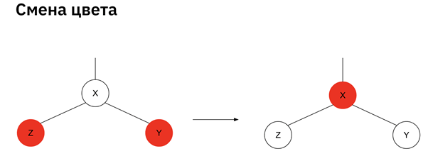

# Сбалансированное "черно-красное" бинарное дерево поиска
## binarySearchTree.py:
* Дерево, последовательно заполненное значениями от 1 до 10:
```
(value=4, color=black, left=2, right=8) 
(value=8, color=black, left=6, right=10)
(value=10, color=black, left=9, right=None)
(value=9, color=red, left=None, right=None)
(value=6, color=red, left=5, right=7)
(value=7, color=black, left=None, right=None)
(value=5, color=black, left=None, right=None)
(value=2, color=black, left=1, right=3)
(value=3, color=black, left=None, right=None)
(value=1, color=black, left=None, right=None)
```

* Дерево, последовательно заполненное значениями от 10 до 1:
```
(value=7, color=black, left=5, right=9)
(value=9, color=black, left=8, right=10)
(value=10, color=black, left=None, right=None)
(value=8, color=black, left=None, right=None)
(value=5, color=black, left=3, right=6)
(value=6, color=black, left=None, right=None)
(value=3, color=red, left=2, right=4)
(value=2, color=black, left=1, right=None)
(value=1, color=red, left=None, right=None)
```

## Схемы операций балансировки
[Гик-брэйнс](https://docs.google.com/document/d/1PCAV5-9bP7Kl0-4Om1wO5Lzh1o_zieGZ/edit)
* Если правый ребенок – красный, а левый - черный, то применяем малый правый поворот:

* Если левый ребенок красный и его левый ребенок тоже красный – применяем малый левый поворот:

* Если оба ребенка красные – делаем смену цвета:
